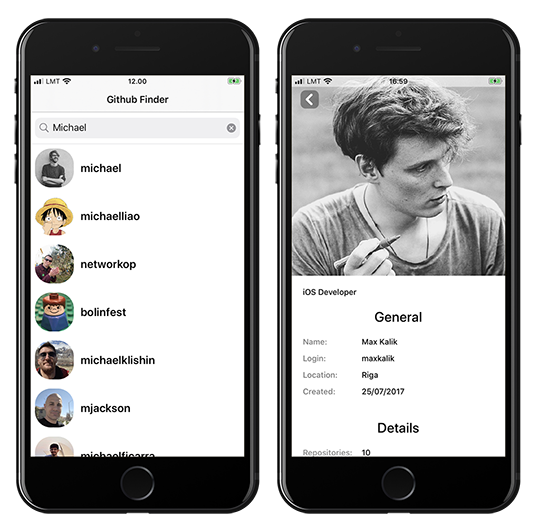

# GitHub Finder App

## Main Objective

Create an iOS application that connects to GitHub API, load a list of users, and show their details on the different screen

## Main functionality

* The data should be fetched from [https://api.github.com/](https://api.github.com/)
* List of data should be a table view with an infinite scroll with fetching 50 users per page
* Table view cell should have avatar and login of a user
* Details view should have details and avatar image of the user. Also, there should be a button to proceed to the HTML URL of the user.

## Requirements

* Objective-C only
* iOS 9 Deployment target
* Autolayout
* Networking
* Custom animations, interactions

## Result

